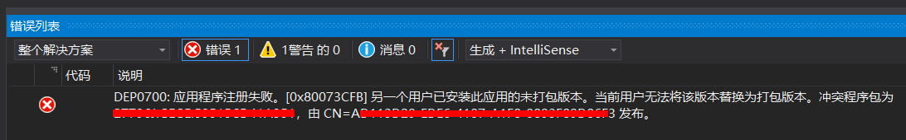
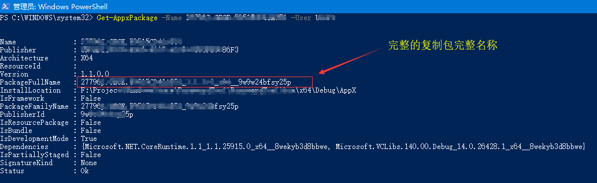
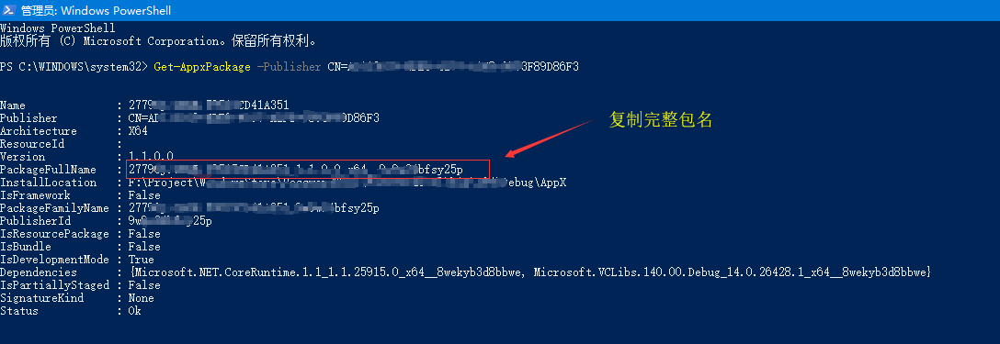

# Windows应用商店调试时提示部署失败

## 出现的状况
> DEP0700:应用程序注册失败。[0x80073CFB]另一个用户已安装此应用的未打包版本。
当前用户无法将该版本替换为打包版本。

## 可能的原因
> 出现这个错误，说明你的计算机上另外一个用户打开了这个解决方案并调试过这个程序，你当前调试失败的原因就是因为它。按照下面的步骤操作完毕后，你当前的用户就可以正常调试了。

# 解决方法

## 根据包名、用户名查询包的安装信息

### Get-AppxPackage -Name {Package Name} -User {user_name}

## 根据发布者、用户名查询包的安装信息
### Get-AppxPackage -Publisher {Publisher} -User {user_name}

## 卸载指定用户名下安装的应用
Remove-AppxPackage -Package {Package Full Name} -User {user_name}

# 参数说明

{Package Name} : 解决方案下 Package.StoreAssociation.xml\ProductReservedInfo\MainPackageIdentityName 的值

{Publisher} : 解决方案下 Package.StoreAssociation.xml\ProductReservedInfo\Publisher 的值

{Package Full Name} : 上面这张图红框圈出的部分

{user_name} : 用于登录 Windows 的用户名
