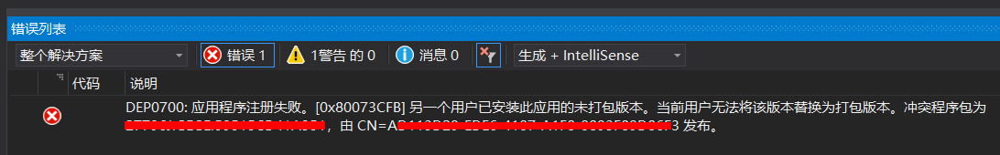
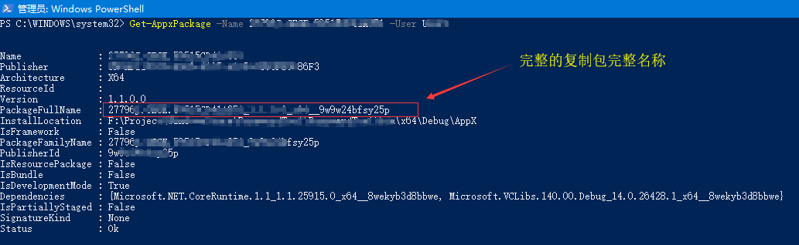

## Windows应用商店调试时提示部署失败

DEP0700:应用程序注册失败。[0x80073CFB]另一个用户已安装此应用的未打包版本。
当前用户无法将该版本替换为打包版本。

## 解决方案

根据包名、用户名查询安装信息
Get-AppxPackage -Name {Package Name} -User {user_name}

根据发布者、用户名查询安装信息
Get-AppxPackage -Publisher {Package Publisher} -User {user_name}

卸载指定用户名下安装的应用
Remove-AppxPackage -Package {Package Full Name} -User {user_name}